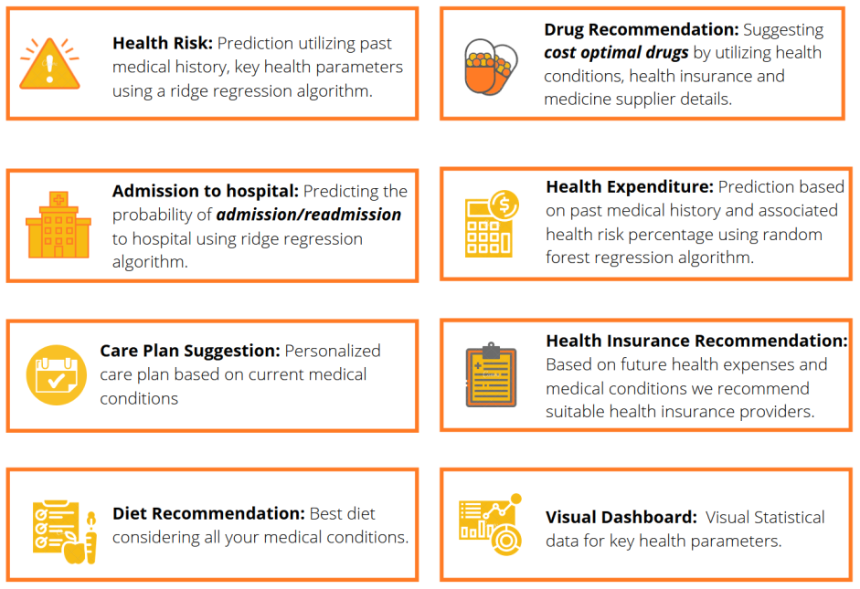
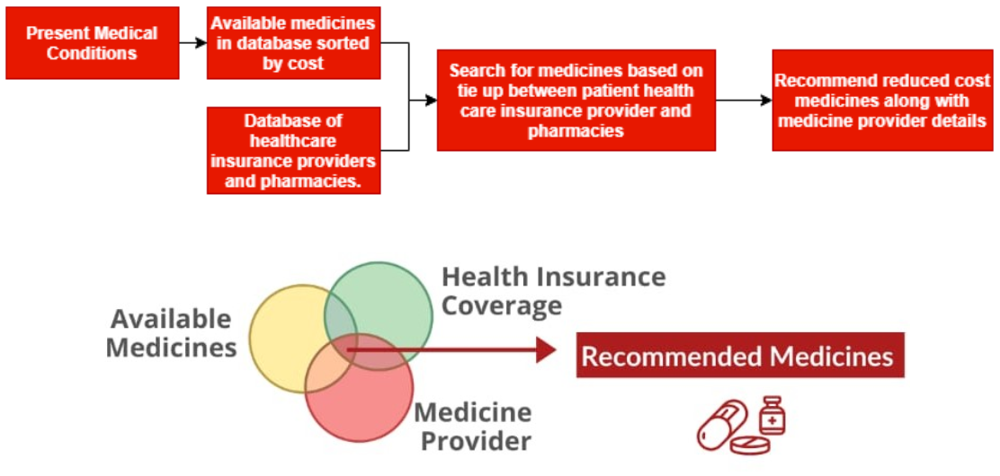
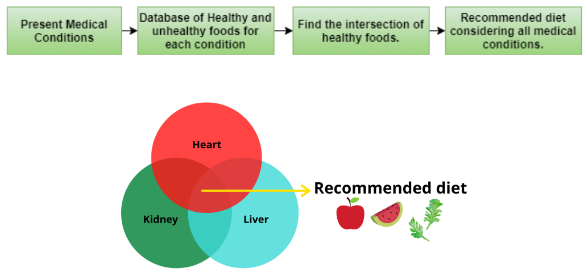

# Patient Cost Reduction System
Hi! Our concept will help you analyse the health of the patient and understand the future possible health risks, hospital admission possibility and health expenditure amount. Along with the diet and care plan, this system recommends the best cost optimal medicines for the existing health conditions considering the patient's health care insurance coverages.

# What we do?

## Medicine Recommendation

## Diet Recommendation

# Impact

# TechStack :computer:

### AI Tools
 - scikitLearn
 - Pandas
 - JupyterNotebook

### Front-End

 - Angular
 - Typescript
 - HTML
 - CSS

### Back-End

 - Flask
 - Python

### Need a Demo ?
Run it on your system by cloning the repositories and running it locally on your machine.

Run following commands for starting up backend in `./backend` folder.

    #install all the dependencies using pip install command used in app.py
    python3 app.py

Run following commands for front-end in `./frontend` folder.

    npm install
    npm start
    
